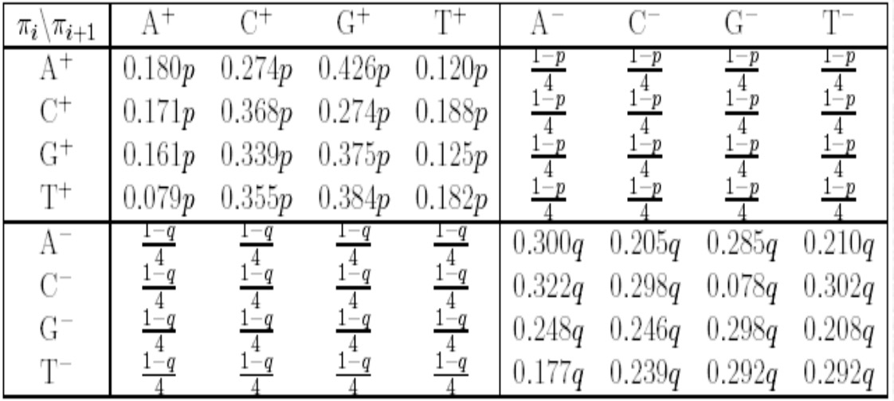
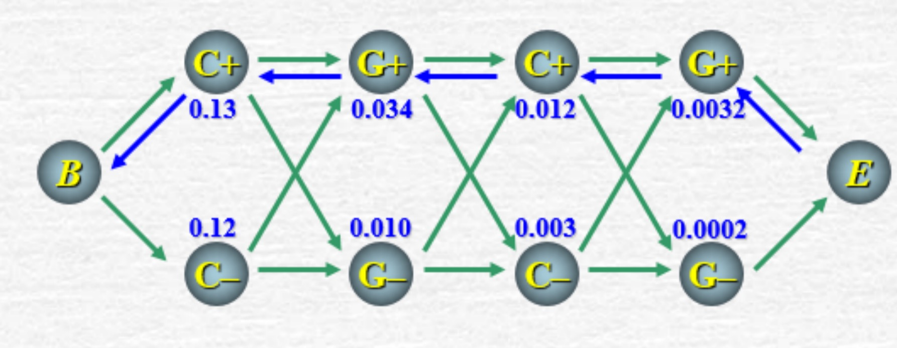
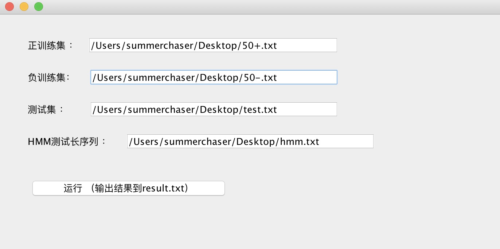
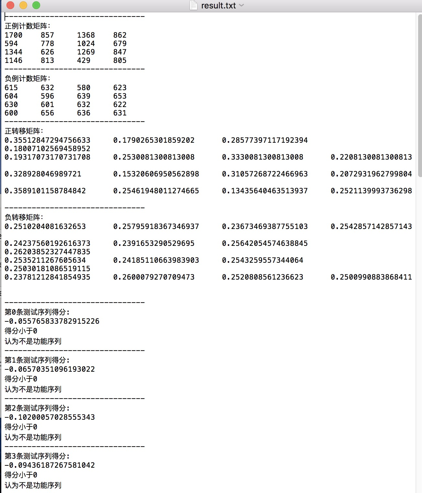
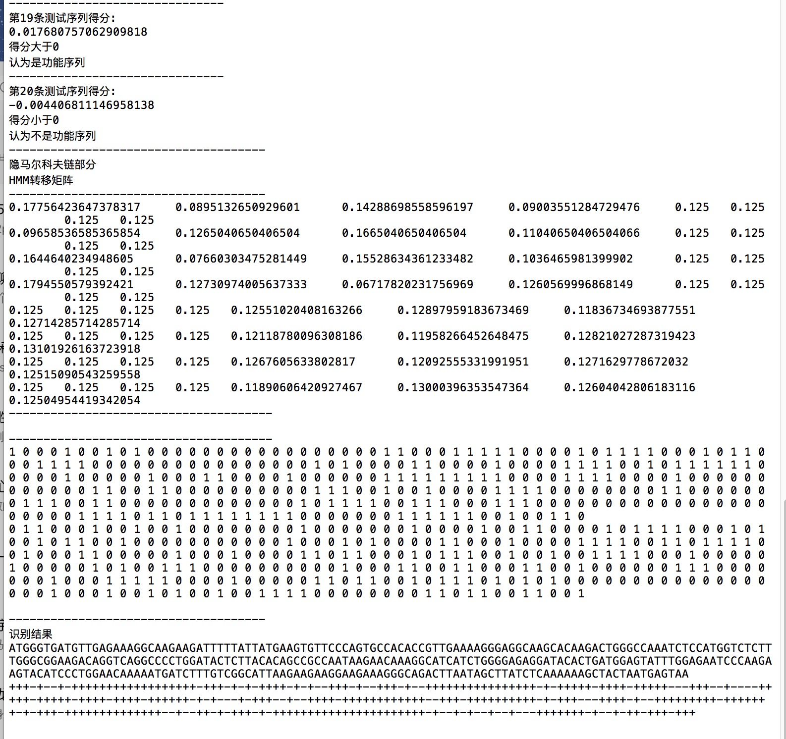

# Markov-HMM      
一阶马尔科夫链和隐马尔科夫模型        
      
### 程序功能：         
在网上收集50条细胞色素C的核心功能区域碱基序列作为正训练集，然后再收集50条碱基序列作为负训练集。收集一些数据作为测试集，通过一阶马尔科夫和隐马模型对测试集中的序列进行识别。        
        
一阶马尔科夫模型 : 给定一段DNA序列片段，判别它是否为胞色素C的核心功能区域。 （整体判别问题）    
隐马尔科夫模型  : 给定一段DNA序列片段，识别细胞色素C的核心功能区域部分。 （区域识别问题） 
               
### 一阶马尔科夫模型           
先分别从正训练集和负训练集中统计双核苷酸出现的频率       
如A转移到A的概率为： AA在序列出现的次数在AA AC AG AT之和的比重   
再根据计算出的频率构造正负训练集的状态转移矩阵       
    
### 一阶马尔科夫模型序列得分值计算方法:          
如对于AC，单项得分为log(AC在正训练集出现概率/AC在符训练集出现概率)       
遍历序列，得分S为所有双核苷酸单项得分之和。        
S>=0，认为正例       
S<0，认为反例      
           
### 隐马尔科夫模型     
选择最大可能状态路径（Most probable state path），即观察序列o1…oT发生概率最高的路径，作为寻求的隐状态路径。  
         
解码问题：求解最可能的隐状态路径（通过+ -隐藏状态的分布识别目标区域）          
主要采用viterbi算法实现       
本实验中状态有8种{A+, C+, G+, T+, A−, C−, G−, T−}，构造8*8的转移矩阵，如下图所示：      
         
       
通过状态转移矩阵，根据viterbi算法求出各个状态的概率，如下图所示：    
        
     
该图由末端最大概率处进行回溯，得到隐状态路径。   
 
### 软件截图

